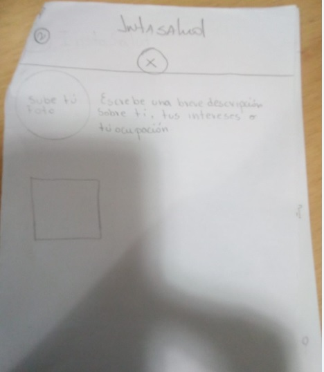

# Creando una Red Social

                                  ## Instasalud
                                  
## Introduccion
La insulina es el principal regulador de la homeostasis de la glucosa y los lípidos.
La insulina disminuye las concentraciones de glucosa, la gluconeogénesis y la lisis de glucógeno en el hígado, así como favorece el ingreso de la glucosa al músculo estriado
y al tejido adiposo. Por otro lado, la insulina favorece la síntesis de triglicéridos en el hígado y en el tejido adiposo, incrementando la circulación de las lipoproteínas por estimular la actividad de la lipoproteína
lipasa en el tejido adiposo e inhibiendo la lipólisis del tejido adiposo y músculo.
La obesidad juega un papel importante en el síndrome de resistencia a la insulina, que incluye hiperinsulinemia,hipertensión,dislipidemia, diabetes mellitus tipo 2 y, por sobre todas las cosas, un riesgo incrementado
a enfermedades cardiovasculares, incluso en niños.

## Resumen del proyecto

En este proyecto se baso en 3 historias de usuarios,cada uno con hijos o familiares que tienen niños menores de 14 años con diagnostico de "resistencia a la Insulina".
para ayudar a cada uno de estos usuarios creamos una red social para ayudar a mantener informados a estos padres con noticias y cuidados para estos niños ya sea en el ambito alimenticio,ejercicios y psicologico de como abordar esta enefermedad de la mejor manera y ademas que ayuden el dia a dia en su nueva vida que adoptan.

### Definición del producto

Realizamos una encuesta en el cual, un total de 24 personas encuestadas indicaron lo siguiente:
1-Te gustaría saber mas sobre una alimentación apta para niños y prevenir enfermedades futuras
a esta respuesta un 91,7%, esta interesada en esta red social y su objetivo.
2-Sabes lo que es Resistencia a la Insulina en niños
a esta respuesta un 62.5%, sabe sobre el tema en cuestion.
3-Te gustaría saber sobre los ejercicios óptimos para ayudar a disminuir el riesgo de esta enfermedad
a esta respuesta un 100% esta interesado.
4-Te gustaría tener una red social que te informe y te muestre tips de ayuda
a esta respuesta un 87,5%,esta de acuerdo con nuestra red social.
a continuacion , se muestra en grafico las estadisticas indicadas en el siguiente link;
https://docs.google.com/forms/d/1XYvF2CklrL4u1xeUYT6hzAYZu__2Dp3wUGbw89uY1Ls/edit#responses

### Historias de usuario

Usuario 1
Yo como nuevo usuario de InstaSalud quiero poder crear una cuenta para loguearme con esta cuenta o gmail.
- **Criterios de Aceptación:** 
>El usuario debe poder crear una cuenta 
>El usuario debería poder loguearse con la contraseña o correo correcto, en caso de error que envié un mensaje   de credenciales incorrectas
>Que se pueda loguear a través de google

Usuario 2
Yo como usuario de InstaSalud quiero poder ingresar al contenido "temas de interés" del menú y poder comentar los artículos 
- **Criterios de Aceptación:** 
>El usuario debe poder hacer ingreso a " temas de interés" al hacer click en logo de manú ("libro")
>El usuario debe poder hacer comentarios en post de interés, editarlos, borrarlos, dar me gusta y poder llevar   un conteo de estos

Usuario 3
Yo como usuario ya registrado quiero poder editar mi perfil para ser parte de la comunidad InstaSalud 

- **Criterios de Aceptación:** 
>Si el usuario se logueo con gmail va aparecer su foto de perfil, de lo contrario mostrara una imagen por        defecto
>El usuario debe poder escribir una breve descripción sobre el y sus intereses
>El usuario debe poder acceder al menú de navegación

- **Definición de terminado:** 

>El código cumple con la guía de estilos acordada
>El código está en el repositorio
>El código pasa los test
>El código tiene code-review
>La historia de implementada ha sido testeada con al menos 3 usuarios y se han incorporado las mejoras que se    identificaron en este testeo de usabilidad
>La red social debe ser responsive 
>Toda la info del perfil debe estar conectada con firebase 

##Trello
https://trello.com/c/PcyFLK6S/2-historia-de-usuario-3

### Diseño de la Interfaz de Usuario (prototipo de baja fidelidad)

### Pruebas unitarias (unit tests)
Se realixaron tres test unitarios con usuarios reales quienes nos dieron su opinion y cambios positivos.
Ellos son:
Alexandra
karen quezada
Gonzalo alonzo 

